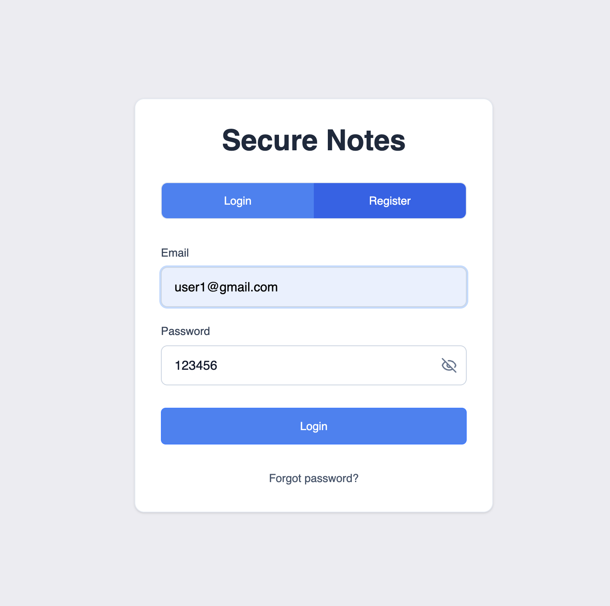
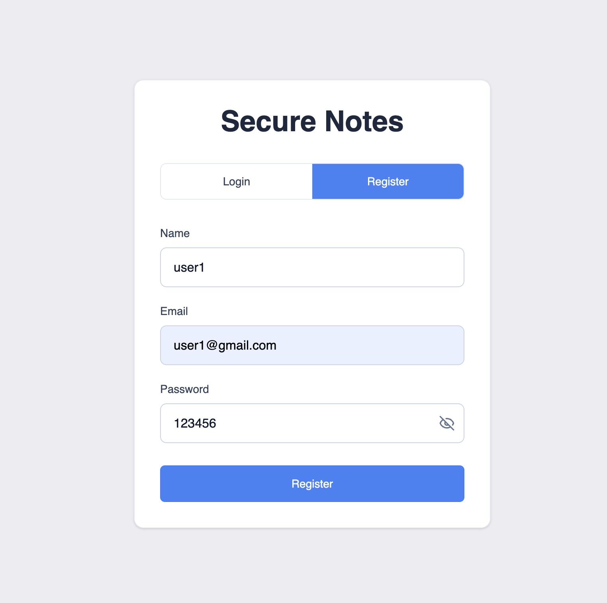
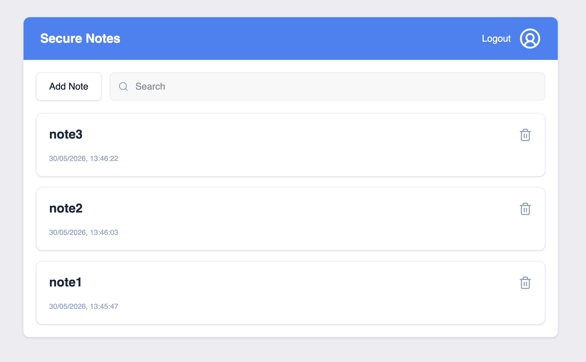
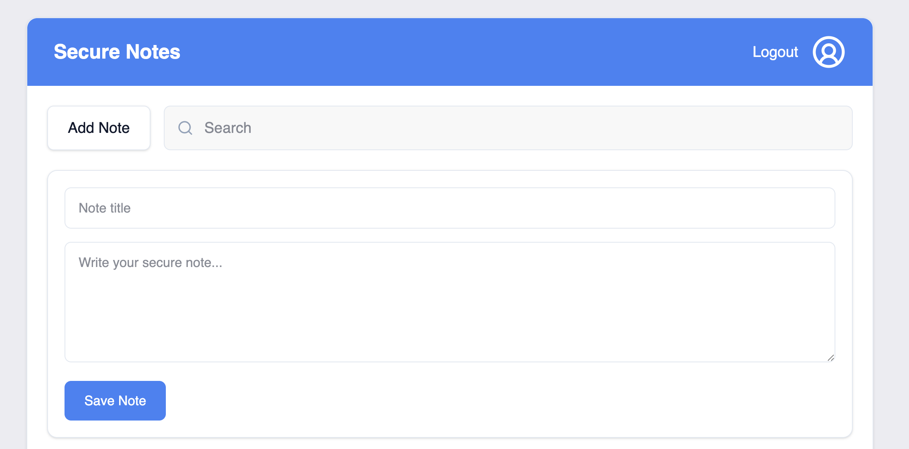
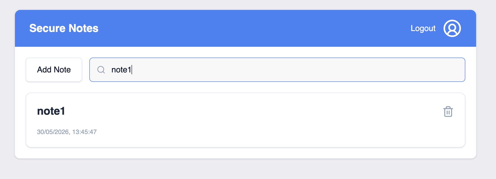

# Secure Notes Application

A full-stack secure notes application built using a modern monorepo architecture with TurboRepo.

Users can securely register, login, and manage encrypted personal notes through a responsive React frontend and a scalable Node.js backend.

---

# Features

## Authentication

* User registration
* User login
* Access & refresh token authentication
* Automatic access token renewal
* Protected routes
* HTTP-only refresh token cookies
* Secure password hashing using bcrypt

---

## Notes Management

* Create secure notes
* Fetch notes
* Delete notes
* Search/filter notes

---

## Security

* AES encrypted note content
* JWT-based authorization
* Protected API routes
* Input validation
* Secure middleware architecture

---

## Frontend

* Responsive UI
* Redux Toolkit state management
* Debounced search
* Reusable component architecture
* TailwindCSS UI
* Axios interceptors
* Toast notifications
* Protected routes
* Logout confirmation modal

---

## Backend

* RESTful APIs
* MongoDB integration
* Centralized error handling
* Refresh token authentication
* Scalable service architecture
* TypeScript support

---

## Testing

* Frontend testing using Vitest & React Testing Library
* Backend testing using Jest & Supertest

---

# Monorepo Architecture

This project uses TurboRepo for monorepo management.

```txt id="j18r1w"
secure-notes-app/
│
├── apps/
│   ├── frontend/
│   └── backend/
│
├── screenshots/
│   ├── login.png
│   ├── register.png
│   ├── dashboard.png
│   ├── create-note.png
│   └── search-notes.png
│
├── postman/
│   └── SecureNotes.postman_collection.json
│
├── docker-compose.yml
├── package.json
├── turbo.json
└── README.md
```

---

# Tech Stack

## Frontend

* React
* TypeScript
* Vite
* Redux Toolkit
* TailwindCSS
* Axios
* React Hook Form
* CryptoJS
* Vitest
* React Testing Library

---

## Backend

* Node.js
* Express.js
* TypeScript
* MongoDB
* Mongoose
* JWT
* bcryptjs
* Jest
* Supertest

---

## Monorepo

* TurboRepo
* npm Workspaces

---

# Project Structure

```txt id="ybmjq0"
apps/
├── frontend/
│   ├── src/
│   ├── public/
│   ├── package.json
│   └── README.md
│
├── backend/
│   ├── src/
│   ├── package.json
│   └── README.md
```

---

# Environment Variables

## Backend

Create:

```txt id="f8pw2f"
apps/backend/.env
```

Example:

```env id="bjvl59"
PORT=8000

MONGO_URI=your_mongodb_connection_string

JWT_SECRET=your_access_token_secret

JWT_EXPIRES_IN=15m

JWT_REFRESH_SECRET=your_refresh_token_secret

JWT_REFRESH_EXPIRES_IN=7d

CLIENT_URL=http://localhost:5173

NODE_ENV=development
```

---

## Frontend

Create:

```txt id="d6x3du"
apps/frontend/.env
```

Example:

```env id="0f9v24"
VITE_API_BASE_URL=http://localhost:8000/api

VITE_AES_SECRET_KEY=your_aes_secret_key
```

---

# Installation

## Clone Repository

```bash id="5b9kp9"
git clone <your-repository-url>
```

---

# Install Dependencies

From root directory:

```bash id="qcdw8j"
npm install
```

---

# Run Frontend + Backend

From root directory:

```bash id="pnijwp"
npm run dev
```

TurboRepo will start:

* frontend
* backend

simultaneously.

---

# Application URLs

## Frontend

```txt id="yxmjpb"
http://localhost:5173
```

---

## Backend

```txt id="3ps8yy"
http://localhost:8000
```

---

# Build Project

```bash id="if2l4z"
npm run build
```

---

# Start Production Build

```bash id="wxg2lo"
npm run start
```

---

# Run Tests

## Frontend Tests

```bash id="vw8w4i"
npm run test --workspace=frontend
```

---

## Backend Tests

```bash id="8z7mdh"
npm run test --workspace=backend
```

---

## Run All Tests

```bash id="eqz4m4"
npm test
```

---

````md
# Docker Support

This project includes Docker Compose support for running MongoDB locally.

Start MongoDB container:

```bash
docker compose up -d
````

If using local Docker MongoDB, update backend `.env`:

```env
MONGO_URI=mongodb://localhost:27017/secure-notes-db
```

The project currently uses MongoDB Atlas by default.

```
```


---

# API Endpoints

## Authentication

### Register

```http id="4b18e0"
POST /api/auth/register
```

### Login

```http id="wy99pr"
POST /api/auth/login
```

### Refresh Access Token

```http id="z5v3ki"
POST /api/auth/refresh-token
```

### Logout

```http id="lf5w0d"
POST /api/auth/logout
```

---

## Notes

### Get Notes

```http id="3wyj1f"
GET /api/notes
```

### Search Notes

```http id="9jdlxq"
GET /api/notes?search=value
```

### Create Note

```http id="1kt40p"
POST /api/notes
```

### Delete Note

```http id="ys2kw0"
DELETE /api/notes/:id
```

---

# Screenshots

## Login Page



---

## Register Page



---

## Dashboard



---

## Create Note



---

## Search Notes



---

# Postman Collection

The Postman collection is available inside:

```txt id="7sdu7v"
/postman/SecureNotes.postman_collection.json
```

---

# Security Notes

This project encrypts note content on the client side using AES encryption before storing it in the database.

For production-grade applications:

* encryption keys should not live in frontend bundles
* secure key management services should be used
* refresh tokens should be rotated and invalidated properly
* HTTPS should always be enabled in production

This implementation is intended for assessment/demo purposes.

---

# Future Improvements

* Edit notes functionality
* Pagination
* Swagger documentation
* Dark mode
* Rich text editor
* Email verification
* Password reset flow
* Role-based authorization

---

# Individual App Documentation

Detailed documentation is available inside:

```txt id="rx6h7t"
apps/frontend/README.md

apps/backend/README.md
```

---

# Author

Developed as a Full Stack React Developer Assessment Project using React, TypeScript, Node.js, MongoDB, and TurboRepo.
